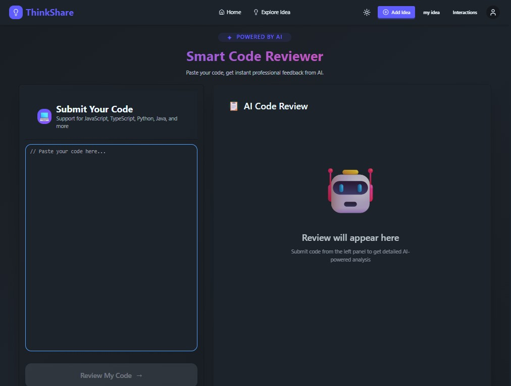

***

# 📸 Project Preview



***

# 🏗️ System Architecture

```text
                        User
                          │
                          ▼
              ┌────────────────────┐
              │   Next.js Frontend │
              │ React • TypeScript │
              └──────────┬─────────┘
                         │
                    REST API
                         │
                         ▼
             ┌─────────────────────┐
             │   Express Backend   │
             │ Authentication API  │
             └──────────┬──────────┘
                        │
        ┌───────────────┼────────────────┐
        │               │                │
        ▼               ▼                ▼
 Better Auth       MongoDB         Gemini AI API
 Authentication     Database       Code Review
        │               │                │
        └───────────────┴────────────────┘
                        │
                        ▼
                 JSON Response
                        │
                        ▼
                  Next.js Frontend
```

---

# 🧩 Application Flow

```text
User
 │
 ▼
Login / Register
 │
 ▼
Authentication (Better Auth)
 │
 ▼
JWT Session Created
 │
 ▼
Dashboard
 │
 ├──────────────┐
 │              │
 ▼              ▼
Ideas        AI Review
 │              │
 ▼              ▼
MongoDB     Gemini API
 │              │
 └──────┬───────┘
        ▼
 Render Updated UI
```

---

# 🗂️ Folder Structure

```text
src
│
├── app
│   ├── (auth)
│   ├── dashboard
│   ├── community
│   ├── ideas
│   ├── api
│   └── layout.tsx
│
├── components
│   ├── ui
│   ├── shared
│   ├── cards
│   ├── forms
│   └── navbar
│
├── hooks
├── lib
├── providers
├── services
├── types
├── utils
├── constants
└── middleware.ts
```

---

# 🔄 Request Lifecycle

```text
Browser
   │
   ▼
Next.js Route
   │
   ▼
API Service
   │
   ▼
Express API
   │
   ▼
Controller
   │
   ▼
MongoDB
   │
   ▼
JSON Response
   │
   ▼
SWR Cache
   │
   ▼
React UI Update
```

---

# 📡 REST API Documentation

## Authentication

| Method | Endpoint | Description |
|--------|----------|-------------|
| POST | `/api/auth/login` | Login user |
| POST | `/api/auth/register` | Register user |
| POST | `/api/auth/logout` | Logout user |

---

## Ideas

| Method | Endpoint | Description |
|--------|----------|-------------|
| GET | `/api/ideas` | Get all ideas |
| GET | `/api/ideas/:id` | Get single idea |
| POST | `/api/ideas` | Create new idea |
| PATCH | `/api/ideas/:id` | Update idea |
| DELETE | `/api/ideas/:id` | Delete idea |

---

## Comments

| Method | Endpoint | Description |
|--------|----------|-------------|
| GET | `/api/comments/:ideaId` | Get comments |
| POST | `/api/comments` | Add comment |
| DELETE | `/api/comments/:id` | Delete comment |

---

## AI

| Method | Endpoint | Description |
|--------|----------|-------------|
| POST | `/api/ai/review` | Review source code using Gemini AI |

---

# 📦 API Request Example

### Create New Idea

```http
POST /api/ideas
Content-Type: application/json
Authorization: Bearer <token>
```

### Request

```json
{
  "title": "React Performance Tips",
  "description": "Best practices for optimizing React applications.",
  "tags": ["React", "Performance"]
}
```

### Success Response

```json
{
  "success": true,
  "message": "Idea created successfully",
  "data": {
    "_id": "6884abc12345",
    "title": "React Performance Tips"
  }
}
```

---

# 🔐 Authentication Flow

```text
User Login
     │
     ▼
Better Auth
     │
     ▼
Validate Credentials
     │
     ▼
Generate JWT
     │
     ▼
Store Session
     │
     ▼
Protected Routes
```

---

# 🚀 Deployment Architecture

```text
                 GitHub
                    │
                    ▼
               Vercel Deploy
                    │
     ┌──────────────┴──────────────┐
     │                             │
     ▼                             ▼
 Next.js Frontend           Express Backend
     │                             │
     └──────────────┬──────────────┘
                    ▼
                 MongoDB Atlas
```

---

# 📈 Future Improvements

- ✅ Real-time Chat
- ✅ Notifications
- ✅ Bookmark Ideas
- ✅ Rich Text Editor
- ✅ Image Upload
- ✅ Email Verification
- ✅ Docker Support
- ✅ Unit Testing
- ✅ CI/CD Pipeline
- ✅ Admin Analytics Dashboard

---